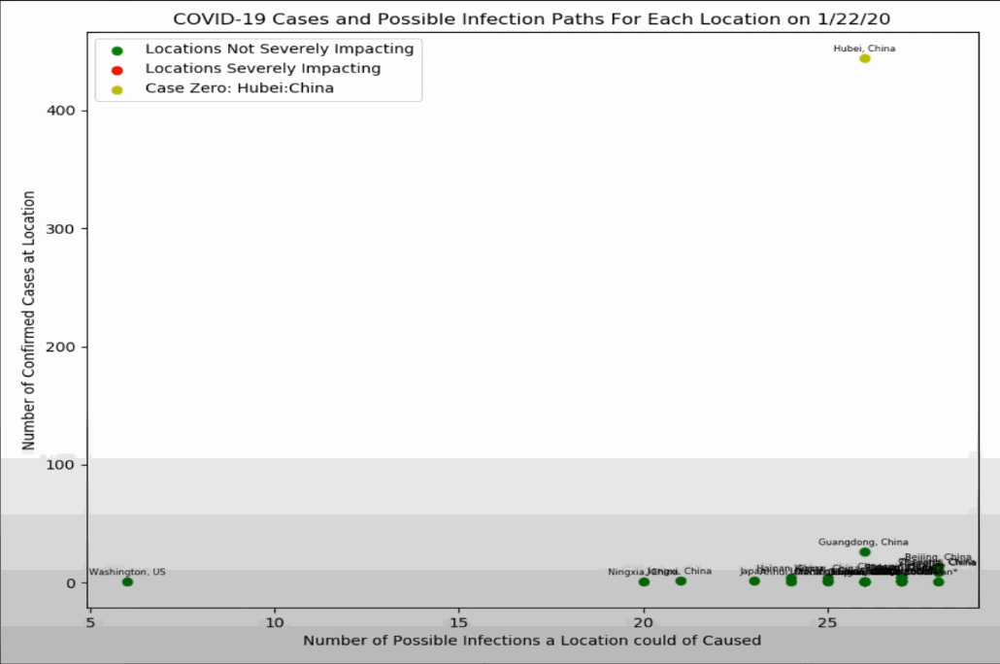
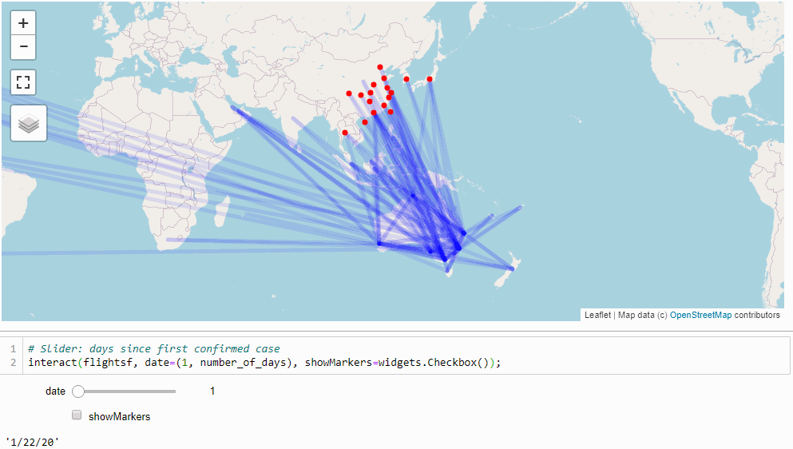

# COVID-19 Outbreak Spread

Analyising the covid-19 outbreak spread using flight routes data and confirmed cases data to determine the infection across locations. Through the analyiss of the flight routes networks, the key contributing infection paths and hubs can be identified. 
This student project was developed during the unit [CITS4403 Computational Modelling](https://handbooks.uwa.edu.au/unitdetails?code=CITS4403) also called complexity science.

## Intallations

Create the environment to run the notebook use:
`conda env create -f environment.yml`

If you already have the environment setup and need to install new packages while the environment is activated:
`conda env update --file environment.yml`

## Jupyter Notebooks for Analysing COVID-19
- coronavirus_infection_path.ipynb (Infection Graph Analysis)
- coronavirus_timeline.ipynb (Analysing various attributes of Routes Network with COVID-19)

## Data
* [COVID-19 Data Repository by the Center for Systems Science and Engineering (CSSE) at Johns Hopkins University](https://github.com/CSSEGISandData/COVID-19)
* [Airport Locations and Flight Routes Dataset](https://aviation-edge.com/)
* [Australian Border closures](https://www.pm.gov.au/media/updated-travel-advice-protect-australians-novel-coronavirus)
* Border closures: [restrictions.info](https://restrictions.info/), [Al Jazeera](https://www.aljazeera.com/)

## Stack
* [Jupyter notebook](https://jupyter.org/) ([Python](https://www.python.org/))
* [Pandas](https://pandas.pydata.org/)
* [NetworkX](https://networkx.github.io/)
* [ipyleaflet](https://ipyleaflet.readthedocs.io/en/latest/)
* [ipywidgets](https://ipywidgets.readthedocs.io/en/stable/)

## Demos
We assume that most cases of the virus that spread into different countries was due to air travel (rather than boat, foot, etc.)

